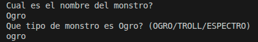
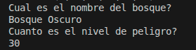
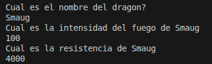
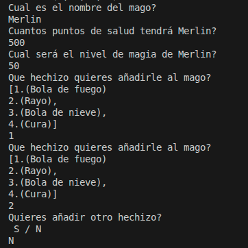
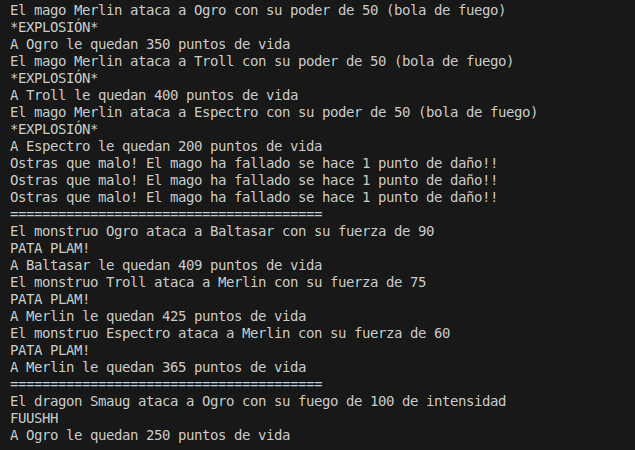
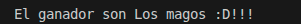
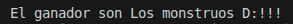

La aplicación comenzará preguntando por todos los datos necesarios previos a comenzar una batalla:
- 3 Monstruos (Nombre y tipo)
  
  
- Bosque (Nombre y Nivel de peligro)
  
  
- Dragon (Nombre, Intensidad de fuego y Resistencia)
  
  
- 2 Magos (Nombre, Salud, Nivel de magia y Hechizos)
  
  
Para añadirle los hechizos de los magos se seleccionara un mínimo de 2 hechizos de una lista de 4, para seguir añadiendo hechizos a partir del segundo habrá que seleccionar la opción S y para acabar de añadir habrá que seleccionar N

#### VISUALIZACIÓN DE LOS TURNOS
En cada turno el orden de ataques irá de la siguiente forma: 
1. Los magos atacan a todos los monstruos del bosque 
   (Los magos atacan en área, fallarán si intentan lanzar un hechizo que no esté en su lista de hechizos y recibiran 1 punto de daño por cada monstruo al que fallen su hechizo.
Los magos tienen la misma posibilidad de lanzar cada uno de los cuatro hechizos.
Al agotar su lista de hechizos los magos pasarán a lanzar un ataque por defecto, que solo afectará a un monstruo aleatorio)
2. Cada monstruo ataca a un mago aleatorio
3. El dragon ataca al monstruo jefe del bosque

En el último turno se imprimirá si ganaron los magos o los monstruos

